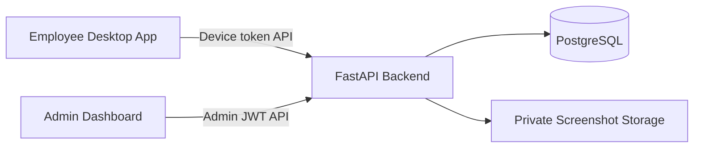

# Khaliduo

Khaliduo is a Kent Consultancy product with three connected parts:

- `backend/`: the FastAPI backend for data, authorization, screenshots, teams, time requests, timesheets, and reports.
- `frontend/desktop-agent/`: the employee-facing Electron app.
- `frontend/admin-dashboard/`: the admin-facing dashboard.

Both frontends talk to the same backend.



## Employee Onboarding

The admin dashboard owns device enrollment:

1. General Admin creates the employee.
2. General Admin generates a single-use enrollment code on the employee details page.
3. Employee installs Khaliduo on the laptop and enters that code.
4. The desktop app receives a device token and starts sending sessions, activity, and screenshots.

Team Owners can view data for their assigned teams, but device enrollment codes are managed by General Admins.

## Project Structure

```text
khaliduo/
|-- backend/            # Shared backend API
|-- frontend/
|   |-- desktop-agent/  # Employee app frontend + Electron shell
|   `-- admin-dashboard/# Admin dashboard frontend
|-- archive/            # Inactive rollback/reference code
|-- deployment/
|-- docs/
|-- scripts/
|-- package.json        # Root convenience scripts
|-- docker-compose*.yml
`-- README.md
```

`archive/admin-dashboard-basic/` is not part of the active app. `lovable-dashboard/` may exist locally as an ignored source clone, but the active admin dashboard is `frontend/admin-dashboard/`.

## Local Development

Start the backend from its folder:

```powershell
cd backend
npm run dev
```

Start the web frontend from its shared folder:

```powershell
cd frontend
npm run dev
```

You can also start either frontend separately:

```powershell
npm run dev:admin
npm run dev:desktop
```

## Windows App & Screenshot Controls

Build the Windows installer:

```powershell
npm run build:installer
```

The installer is created at `frontend/desktop-agent/release-khaliduo/KhaliduoSetup.exe`. Installing it creates
**Khaliduo** shortcuts on the Desktop and Start menu.

Employees can download the current installer from `/download`. The backend serves it from
`GET /api/v1/downloads/windows`; set `DESKTOP_INSTALLER_PATH` to the built installer location.

Version 1.1.4 makes desktop updates required. The app checks shortly after startup and every 15
hours, downloads a newer signed version in the background, then shows an installation message,
safely closes the active session, installs the update, and restarts automatically. The update state
is also visible in the app and beside the Windows clock.

The build also creates `latest.yml` and `KhaliduoSetup.exe.blockmap` beside the installer. The
backend serves all three files from `/api/v1/updates/windows/`; set `DESKTOP_UPDATE_DIRECTORY` to
that directory. Before every production build, increase the version in `frontend/desktop-agent/package.json`
and set the public HTTPS update URL:

```powershell
$env:VITE_API_BASE_URL="https://your-api-domain.example/api/v1"
$env:KHALIDUO_EMPLOYEE_PORTAL_URL="https://your-dashboard-domain.example/employee"
$env:KHALIDUO_UPDATE_URL="https://your-api-domain.example/api/v1/updates/windows"
npm run build:installer
```

Do not upload only the EXE: deploy the EXE, blockmap, and `latest.yml` from the same build together.
Existing installations without the updater need one final manual installation. Versions containing
the updater move to later releases automatically.

After successful enrollment, Khaliduo registers itself to start hidden when the employee signs in to
Windows. Before enrollment, automatic startup remains disabled.

For company-owned Windows devices, create the internal Kent Consultancy signing chain once:

```powershell
powershell -ExecutionPolicy Bypass -File scripts/setup-internal-code-signing.ps1
npm run build:installer
```

The public trust certificates and employee installation script are written to
`frontend/desktop-agent/release-khaliduo/trust/`. Keep the private signing key in the build computer's
Windows certificate store; never copy it to employee devices.

The assisted Windows installer embeds the two public certificates and installs them for the whole
computer while Khaliduo is installed. The person installing Khaliduo must approve the Windows
Administrator prompt. The standalone trust script remains available as a fallback for managed
deployment.

Installer builds now require the internal signing certificate. For a deliberate local-only unsigned
test build, set `KHALIDUO_ALLOW_UNSIGNED_BUILD=1` for that command only.

The build command prints the full installer path when it finishes, so there is no need to search
for the generated file.

Khaliduo stays available from the shield icon in the Windows notification area near the clock.
Click the shield to open the status window, or right-click it to pause/resume tracking and
screenshots. Closing the window now asks whether to keep tracking, pause, or quit; it never hides
silently.

Screenshot timing is intentionally unpredictable. In each configured interval (10 minutes by
default), Khaliduo schedules one or two captures at random, separated points. Employees can see
whether screenshots are active or paused, but never the exact next capture time.

## Employee Portal

Employees can open `/employee` in the admin-dashboard domain to view their own dashboard. A General
Admin creates or rotates the employee access key from **Employees → employee → Employee portal**.
The employee signs in with their work email and that key.

The employee dashboard includes:

- Active time, approved manual time, screenshots, and points for today, this week, and this month.
- Assigned teams/projects/tasks.
- The employee's own screenshots only.
- Manual time requests for offline meetings, client visits, workshops, or other approved work away
  from the computer.

One approved active hour equals **one point**. Approved manual time is included. Idle time is not.

When mouse/keyboard activity returns after the idle threshold, Khaliduo asks the employee to continue
tracking, stop tracking, or prepare a manual time request. Deleting a screenshot also deducts the time
slice represented by that screenshot from the related work session.

The admin employee/device pages show the employee email, last employee-portal login IP, Windows user,
device, and last agent IP. Employee web access uses a separate revocable key and a 12-hour access
token; the device token is never exposed to the browser.

Useful URLs:

```text
Backend health:  http://127.0.0.1:8000/api/v1/health
Backend docs:    http://127.0.0.1:8000/docs
Admin dashboard: http://localhost:5174
```

## Validation

Run all current validation commands:

```powershell
npm run validate
```

This runs backend tests and compile checks, then admin and desktop lint/build checks.

## Configuration

Copy `.env.example` files to local `.env` files and set real secrets outside source control.

The backend API URL, admin dashboard origin, Lovable origin, and production API domain are environment-configurable. Production URLs are intentionally not hardcoded.
