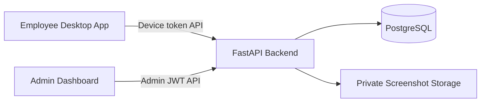

# Architecture

Khaliduo uses the common "one backend, two frontends" layout.

## Active Applications

- `backend-api/`: shared FastAPI backend, PostgreSQL models, migrations, storage, and authorization.
- `desktop-agent/`: employee-facing Electron app that records time, sends activity, uploads screenshots, and sends time adjustment requests.
- `admin-dashboard/`: admin-facing dashboard for teams, employees, screenshots, devices, timesheets, reports, users, audit log, and time requests.

## Inactive References

- `archive/admin-dashboard-basic/`: older simple dashboard kept only as a rollback reference.
- `lovable-dashboard/`: optional ignored source clone from Lovable. It is not used at runtime.

The employee app does not expose screenshot viewing. Screenshot listing and file download are protected by admin authentication and team-scoped backend authorization.
